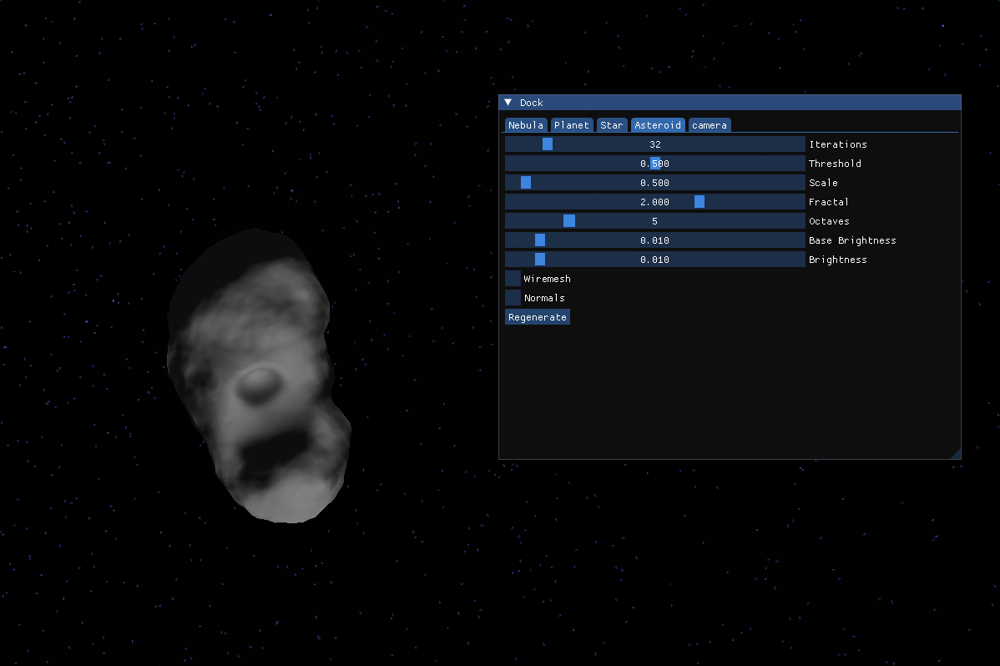
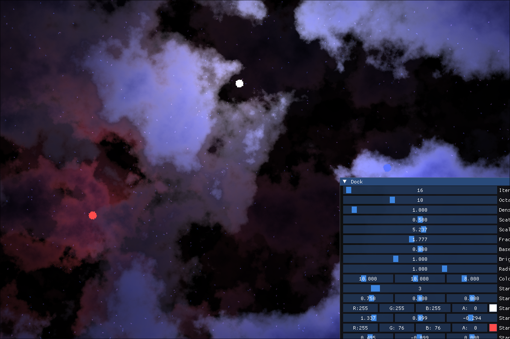
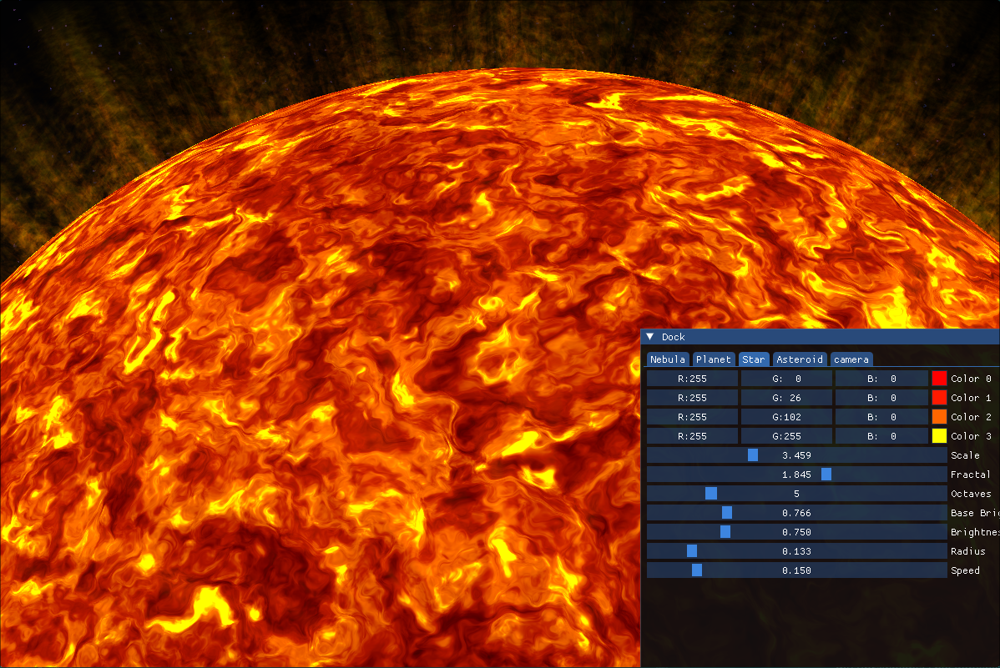
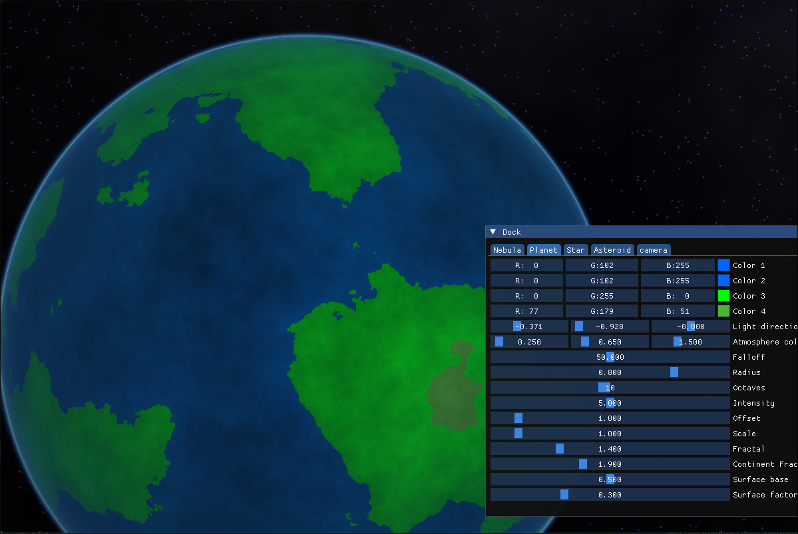

# Rendering library
## How to build:
Library was developed under linux OS, but it *should* work anywhere OpenGL is supported

Install Cmake build system and then, Glfw, Glm and ImGui libraries.
CMake will try figure out their location on it's own

Run
`cmake -S . -B ./build`

Then
`cmake --build ./build`

## How to run:
`./build/demo/deep_space_demo`

The loading may take up to a minute, depending on graphical quality and used GPU.

## Usage

Move camera via WSAD keys, holding right mouse button allows for moving camera around the scene, for the fixed camera variant, please check appropriate checkbox in 'Camera' tab. Other tabs allow for tweaking the look of objects on the scene.

## What to expect:

Procedural Asteroids

Volumetric Nebulas

Procedurally animated stars

Customisable planets

